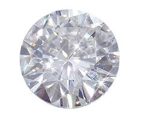

```{r setup, include=FALSE}
knitr::opts_chunk$set(echo = FALSE)
```


## Diamond Price Predictor

**Predict the price of your next diamond!**
Are you having trouble deciding on how much you should spend on a diamond?

<center></center>

Look no further and head over to the Diamond Price Predictor:
<https://marcodulog.shinyapps.io/DiamondPricePredictor/>


## Harness the Power of Data Science

Diamond prices can vary quite a bit but with this application, you can harness the power of data science to help you make sure that you pay the right price.  We selected a sample of 5000 diamonds to help build a simple model to help you with your selection process.  

The major factors in choosing a diamond are:

- Carat - weight of the diamond (0.2-5.01)
- Color - quality of the cut (Fair, Good, Very Good, Premium, Ideal)
- Cut - diamond colour, from J (worst) to D (best)
- Clarity - a measurement of how clear the diamond is (I1 (worst), SI1, SI2, VS1, VS2, VVS1, VVS2, IF (best))

## Here's a Sample of our Diamond Database
```{r echo=FALSE, message=FALSE}
library(dplyr)
library(ggplot2)
set.seed(1000)
obs<-5000
sample<-diamonds[sample(1:length(diamonds$price), obs, replace=FALSE),]

select(sample, carat, cut, color, clarity, price)
```


## Looking at all the Facets

Investigating by hand can take a while to process.  Why look at complicated charts when you can point and click your way through making the right decision?

```{r cars, echo = FALSE, message=FALSE}

qplot(carat, price, data = sample, facets = clarity ~ color, col=cut)
```

## Thanks for looking!


